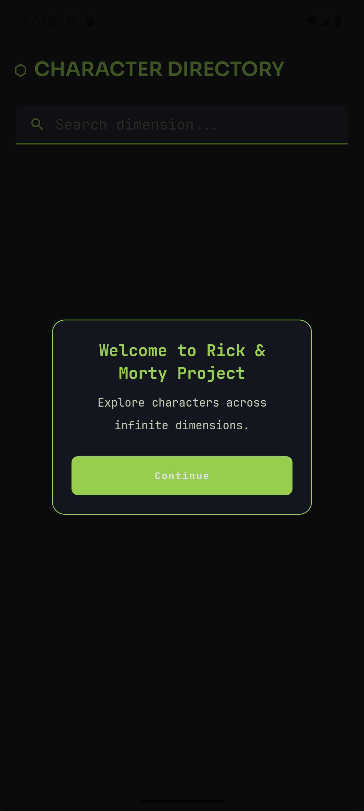
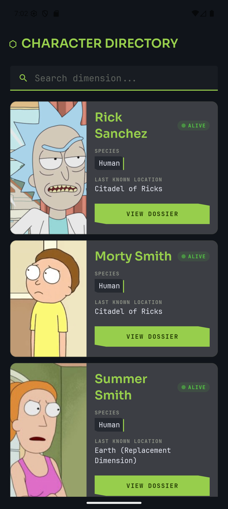
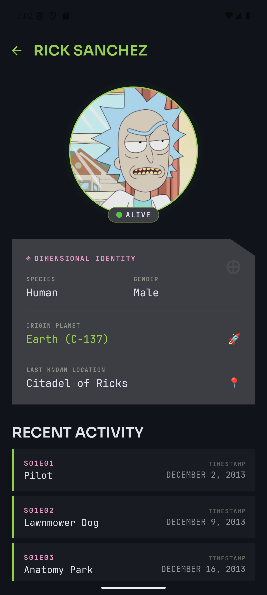

# Rick & Morty — KMP Explorer

A **Kotlin Multiplatform** app targeting Android and iOS that lets you browse characters from the [Rick and Morty API](https://rickandmortyapi.com/). Built with Compose Multiplatform, it features a sci-fi "Dimension C-137" dark theme with portal-green accents.

---

## Screenshots

| Welcome | Character List | Character Detail |
|:---:|:---:|:---:|
|  |  |  |

---

## Features

- Browse all Rick & Morty characters with infinite scroll (Paging 3 + Room cache)
- Search characters in real time with 300 ms debounce
- Detail view with dimensional identity card, status badge, and episode history
- Offline support — cached data shown with an offline banner
- Welcome dialog on first launch

---

## Tech Stack

| Layer | Libraries |
|---|---|
| UI | Compose Multiplatform (Material 3) |
| Architecture | ViewModel + StateFlow (Koin DI) |
| Networking | Ktor |
| Persistence | Room + SQLDelight |
| Paging | Jetpack Paging 3 |
| Images | Coil 3 |
| Build | Gradle 9 · KMP 2.x |

---

## Project Structure

```
RickMortyKMPClaude/
├── androidApp/          Android entry point (MainActivity)
├── iosApp/              iOS entry point (SwiftUI wrapper)
└── shared/
    └── src/
        ├── commonMain/  Shared Kotlin — UI, domain, data, DI
        ├── androidMain/ Android-specific expect implementations
        └── iosMain/     iOS-specific expect implementations
```

**Package:** `com.mutissx.rickmortykmpclaude`

```
presentation/
  ui/          Composable screens and components
  viewmodel/   ViewModels
domain/
  model/       Data classes
  repository/  Repository interfaces
  usecase/     Business logic
data/
  remote/      Ktor API client
  local/       Room database
  paging/      Paging sources and mediators
  repository/  Repository implementations
di/            Koin modules
```

---

## Running the App

### Android

```bash
./gradlew :androidApp:assembleDebug
# then install the APK, or run directly from Android Studio
```

### iOS

Open `/iosApp` in Xcode and press **Run**.

---

## Claude Automated Task Pipeline

This project uses a **Claude Code task pipeline** to implement features automatically from a one-line description.

### How it works

```
User types:  execute-task TASKN <description>
                    │
                    ▼
        ┌─────────────────────┐
        │   execute-task      │  Creates feature branch from develop
        │                     │  Generates implementation plan
        └────────┬────────────┘
                 │
                 ▼
        ┌─────────────────────┐
        │ execute-task-approve│  Presents plan to user for approval
        └────────┬────────────┘
                 │  (user types "yes")
                 ▼
        ┌─────────────────────┐
        │   android-expert    │  Implements the plan step by step
        │                     │  Runs ktlint · builds the project
        └────────┬────────────┘
                 │
                 ▼
        ┌─────────────────────┐
        │    pr-manager       │  Commits, pushes, opens GitHub PR
        └─────────────────────┘
```

### Slash commands

| Command | Role |
|---|---|
| `/execute-task TASKN <description>` | Kick off the pipeline — creates branch + plan |
| `/execute-task-approve TASKN <description>` | Present plan for approval (auto-invoked) |
| `/android-expert TASKN <description>` | Implement + build (auto-invoked after approval) |
| `/pr-manager TASKN <description>` | Commit + push + open PR (auto-invoked after build) |

### Example

```
/execute-task TASK7 Open a dialog at startup saying Welcome to Rick & Morty Project and a button Continue
```

The pipeline creates `feature/task-TASK7` from `develop`, writes the code, verifies the build, and opens a pull request — all without manual steps beyond approving the plan.

---

## Running Tests

```bash
# Android unit tests
./gradlew :shared:testAndroidHostTest

# iOS simulator tests
./gradlew :shared:iosSimulatorArm64Test
```

---

## Learn More

- [Kotlin Multiplatform](https://www.jetbrains.com/help/kotlin-multiplatform-dev/get-started.html)
- [Compose Multiplatform](https://www.jetbrains.com/lp/compose-multiplatform/)
- [Rick and Morty API](https://rickandmortyapi.com/)
